## 🌐 Stalk me online here

## 💻 Tech Stack
Tools and technologies I've played with..

### Languages

### Frameworks & Libraries

### Data Stores

### DevOps & Cloud

### Tools

## 📊 Some irrelevant GitHub stats

## 🦾 An inspirational random geeky quote

<!-- LATEST_CONTRIBUTIONS_START -->
## 🤝 Latest Contributions to OSS

- [procore-oss/migration-lock-timeout](https://github.com/procore-oss/migration-lock-timeout): [1 commits](https://github.com/pjmartorell?tab=overview&from=2025-10-01&to=2025-10-31)
<!-- LATEST_CONTRIBUTIONS_END -->

<!-- LATEST_STARRED_REPOS_START -->
## ⭐ Latest Starred Repos

| Repository | Description |
|------------|-------------|
| [BetterShift](https://github.com/panteLx/BetterShift) | Your favorite shift management application! |
| [system_prompts_leaks](https://github.com/asgeirtj/system_prompts_leaks) | Collection of extracted System Prompts from popular chatbots like ChatGPT, Claude & Gemini |
| [SMRY](https://github.com/mrmps/SMRY) | A tool to get summaries and get past paywalls |
| [Harmony-Music](https://github.com/anandnet/Harmony-Music) | A cross platform App for streaming Music |
| [server-survival](https://github.com/pshenok/server-survival) | Tower defense game that teaches cloud architecture. Build infrastructure, survive traffic, learn scaling. |
| [mcp](https://github.com/awslabs/mcp) | Official AWS MCP Servers |
| [rails_ai_agents](https://github.com/ThibautBaissac/rails_ai_agents) | A collection of specialized AI agents for Rails 8.1 development, for AI driven-development and follow TDD best practices. |
| [VibeVoice](https://github.com/microsoft/VibeVoice) | Open-Source Frontier Voice AI |
| [htmldocs](https://github.com/htmldocs-js/htmldocs) | The modern alternative to LaTeX. Create PDF documents templates using React, JSX, and Tailwind |
| [tweakcn](https://github.com/jnsahaj/tweakcn) | A visual no-code theme editor for shadcn/ui components |
| [composio](https://github.com/ComposioHQ/composio) | Composio equips your AI agents & LLMs with 100+ high-quality integrations via function calling |
| [atlassian-rovo-source-code-z80-dump](https://github.com/ghuntley/atlassian-rovo-source-code-z80-dump) | Complete reverse engineering of Atlassian ACLI Rovo Dev binary - extracted source code, system prompts, and technical analysis |
| [open-source-games](https://github.com/bobeff/open-source-games) | A list of open source games. |
| [repomix](https://github.com/yamadashy/repomix) | 📦 Repomix is a powerful tool that packs your entire repository into a single, AI-friendly file. Perfect for when you need to feed your codebase to Large Language Models (LLMs) or other AI tools like Claude, ChatGPT, DeepSeek, Perplexity, Gemini, Gemma, Llama, Grok, and more. |
| [gallery](https://github.com/google-ai-edge/gallery) | A gallery that showcases on-device ML/GenAI use cases and allows people to try and use models locally. |
| [gemma-cookbook](https://github.com/google-gemini/gemma-cookbook) | A collection of guides and examples for the Gemma open models from Google. |
| [maxheadbox](https://github.com/syxanash/maxheadbox) | Tiny truly local voice-activated LLM Agent that runs on a Raspberry Pi |
| [magnus](https://github.com/matsadler/magnus) | Ruby bindings for Rust. Write Ruby extension gems in Rust, or call Ruby from Rust. |
| [selling-partner-api-sdk](https://github.com/amzn/selling-partner-api-sdk) | The official SDK for Amazon Selling Partner API |
| [context7](https://github.com/upstash/context7) | Context7 MCP Server -- Up-to-date code documentation for LLMs and AI code editors |
| [inspector](https://github.com/modelcontextprotocol/inspector) | Visual testing tool for MCP servers |
| [agents.md](https://github.com/agentsmd/agents.md) | AGENTS.md — a simple, open format for guiding coding agents |
| [visual-effect](https://github.com/kitlangton/visual-effect) | Interactive Effect Visualizations |
| [payload](https://github.com/payloadcms/payload) | Payload is the open-source, fullstack Next.js framework, giving you instant backend superpowers. Get a full TypeScript backend and admin panel instantly. Use Payload as a headless CMS or for building powerful applications. |
| [DAWN](https://github.com/berlin-open-wireless-lab/DAWN) | Decentralized WiFi Controller |
| [workflow-use](https://github.com/browser-use/workflow-use) | ⚙️ Create and run workflows (RPA 2.0) |
| [anythingllm-embed](https://github.com/Mintplex-Labs/anythingllm-embed) | AnythingLLM Embed widget submodule for the main AnythingLLM application |
| [browser-agent](https://github.com/magnitudedev/browser-agent) | Open-source, vision-first browser agent |
| [browser-use](https://github.com/browser-use/browser-use) | 🌐 Make websites accessible for AI agents. Automate tasks online with ease. |
| [HeadlessX](https://github.com/saifyxpro/HeadlessX) | The undetected self-hosted browser automation platform. Powered by Camoufox (Firefox) for 0% detection rates. Built for speed, privacy, and scalability. |
| [mcp-playwright](https://github.com/executeautomation/mcp-playwright) | Playwright Model Context Protocol Server - Tool to automate Browsers and APIs in Claude Desktop, Cline, Cursor IDE and More 🔌 |
| [akaunting](https://github.com/akaunting/akaunting) | Online Accounting Software |
| [robodash](https://github.com/Bramjetten/robodash) |  |
| [omarchy](https://github.com/basecamp/omarchy) | Beautiful, Modern & Opinionated Linux |
| [action_push_native](https://github.com/rails/action_push_native) | Rails push notifications for mobile platforms |
| [dspy](https://github.com/stanfordnlp/dspy) | DSPy: The framework for programming—not prompting—language models |
| [mastra-pm-canvas](https://github.com/CopilotKit/mastra-pm-canvas) |  |
| [ag-ui](https://github.com/ag-ui-protocol/ag-ui) | AG-UI: the Agent-User Interaction Protocol. Bring Agents into Frontend Applications. |
| [graphiti](https://github.com/getzep/graphiti) | Build Real-Time Knowledge Graphs for AI Agents |
| [firedup](https://github.com/kashif/firedup) | Clone of OpenAI's Spinning Up in PyTorch |
| [sure](https://github.com/we-promise/sure) | The personal finance app for everyone. NOT affiliated with or endorsed by Maybe Finance Inc. |
| [magspoof](https://github.com/samyk/magspoof) | A portable device that can spoof/emulate any magnetic stripe, credit card or hotel card "wirelessly", even on standard magstripe (non-NFC/RFID) readers. It can disable Chip&PIN and predict AMEX card numbers with 100% accuracy. |
| [ruby-docker](https://github.com/GoogleCloudPlatform/ruby-docker) | Ruby runtime for Google Cloud Platform |
| [passenger](https://github.com/paketo-buildpacks/passenger) |  |
| [nerd-fonts](https://github.com/ryanoasis/nerd-fonts) | Iconic font aggregator, collection, & patcher. 3,600+ icons, 50+ patched fonts: Hack, Source Code Pro, more. Glyph collections: Font Awesome, Material Design Icons, Octicons, & more |
| [upscayl](https://github.com/upscayl/upscayl) | 🆙 Upscayl - #1 Free and Open Source AI Image Upscaler for Linux, MacOS and Windows. |
| [gemini-cli](https://github.com/google-gemini/gemini-cli) | An open-source AI agent that brings the power of Gemini directly into your terminal. |
| [gemini-fullstack-langgraph-quickstart](https://github.com/google-gemini/gemini-fullstack-langgraph-quickstart) | Get started with building Fullstack Agents using Gemini 2.5 and LangGraph |
| [Baileys](https://github.com/WhiskeySockets/Baileys) | Socket-based TS/JavaScript API for WhatsApp Web |
| [ruby_llm](https://github.com/crmne/ruby_llm) | One beautiful Ruby API for OpenAI, Anthropic, Gemini, Bedrock, Azure, OpenRouter, DeepSeek, Ollama, VertexAI, Perplexity, Mistral, xAI, GPUStack & OpenAI compatible APIs. Chat, Vision, Audio, PDF, Images, Embeddings, Tools, Streaming & Rails integration. |
<!-- LATEST_STARRED_REPOS_END -->
